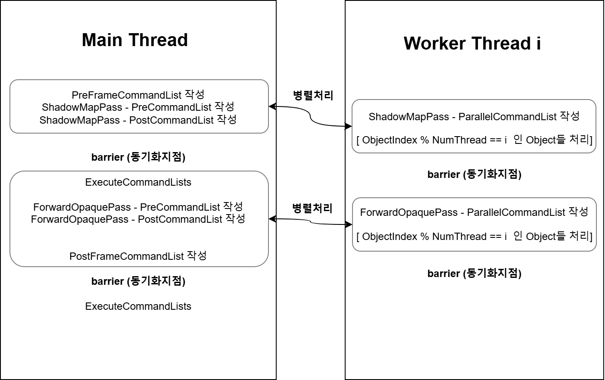

# DirectX12 Renderer

## 개요
- 개발인원 : 개인 프로젝트
- 개발목표 : 그래픽스 학습 및 멀티스레드 렌더링 개념 이해

## 기능
- MultiThread Rendering
- Frames in Flight
- PBR
- ShadowMap
- PostProcess
  
 

- [비행기 쉐이딩 발전 과정](https://wandering-rumba-865.notion.site/227aba645d3280afbfbbd014fd699dd9?pvs=74)
- [멀티스레드 렌더링 성능측정](https://wandering-rumba-865.notion.site/247aba645d32809c9af8cbe2723fd9e9)
 

 

## 참고 자료
- [유영천님 DirectX 12 프로그래밍 소개 강의](https://www.youtube.com/live/Z9veGJv7nPE?si=kNchvTLwyCxX-FnF)
- [홍정모 교수님 DirectX 11 그래픽스 강의](https://honglab.co.kr)

  

## 멀티스레드 렌더링

  
  

